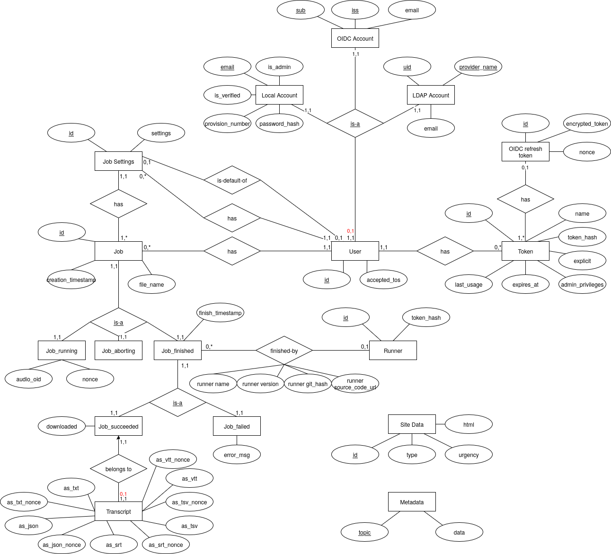

PostgreSQL database design
==========================

The PostgreSQL database schema is carefully designed to closely reflect Project-W's actual data relations and only make wanted database states possible, prohibiting unwanted states (even if the database is being modified directly and not through Project-W software).

For this I created and maintain an ER model that serves as the basis for the current database design:

The red annotations are the attributes how they are actually currently enforced in the PostgreSQL schema in contrary to the ideal attribute (in black). Parts of this ER model is implemented a bit differently than one would expect:

- Inheritance like it occurs in the job is implemented with table constraints instead of PostgreSQL inheritance feature. The reason for this is that FOREIGN KEY constraints don't work well with PostgreSQL inheritance. See `PostgreSQL wiki's Don't Do This <https://wiki.postgresql.org/wiki/Don%27t_Do_This#Don.27t_use_table_inheritance>`_ for more information.

- The `is-default-of` relations are not actually implemented as relations but as a `is_default` field in one of the tables with some added constraints. If I had implemented them as actual relations that would have introduced tables that reference each other which is always a pain to work with.

- I have implemented these PostgreSQL functions and triggers: deleteaudio().

   - deleteaudio() deletes PostgreSQL large objects containing the audio file once a Job gets deleted (which can also happen due to a CASCADE, e.g. when a user gets deleted). This is necessary because `audio_oid` is not explicitly referencing large objects (because it is not possible to reference system tables by default in PostgreSQL) which means that it wouldn't CASCADE DELETE the large object otherwise.
